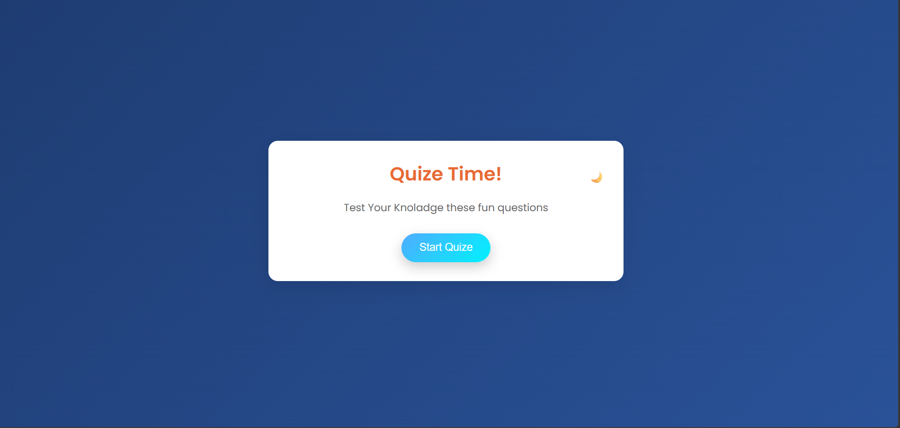
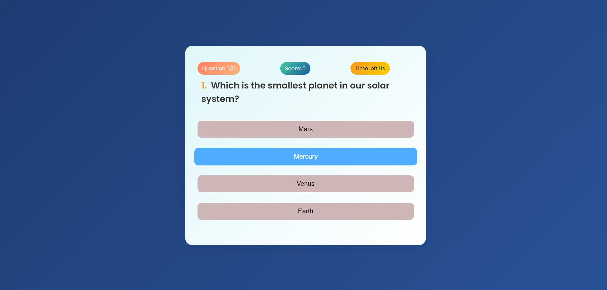
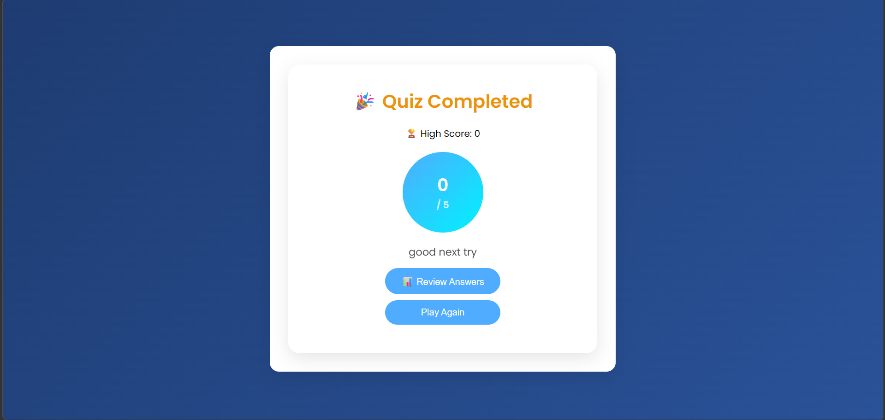

# 🎯 Quiz Game App

A modern and interactive Quiz Game built using **HTML, CSS, and JavaScript**.  
This app includes timer, sound effects, dark mode, answer review, and high score tracking.

---

## 🚀 Live Demo

👉 https://pgorai45.github.io/QUZE-GAME/

---

## ✨ Features

✅ Timer-based quiz  
✅ Sound effects (Correct / Wrong / Tick)  
✅ Dark mode toggle 🌙  
✅ High score tracking 🏆  
✅ Answer review system 📊  
✅ Correct answer display  
✅ Responsive design (Mobile Friendly 📱)  
✅ Modern UI Design  
✅ Popup Review Screen  

---

## 🛠️ Technologies Used

- HTML5
- CSS3
- JavaScript (Vanilla JS)
- GitHub Pages (Deployment)

---

 ## 📸 Screenshots

### Start Screen

### Quiz Screen

### Result Screen

---

## 📂 Project Structure

QUZE-GAME
│
├── index.html
├── style.css
├── script.js
│
├── sounds
│ ├── click.m4a
│ ├── correct.m4a
│ ├── wrong.m4a
│ └── tick.m4a
│
├── screenshots
│ ├── start.png
│ ├── quiz.png
│ └── result.png
│
└── README.md

---

## 🎮 How to Use

1. Click **Start Quiz**
2. Answer questions before time runs out
3. View score and review answers
4. Play again and beat your high score

---

## 🔥 Future Improvements

- Leaderboard system
- Difficulty levels
- API-based questions
- User login system
- Animation improvements

---

## 👨‍💻 Author

**Prasanta Gorai**  
GitHub: https://github.com/pgorai45

---

## ⭐ Support

If you like this project, give it a ⭐ on GitHub!